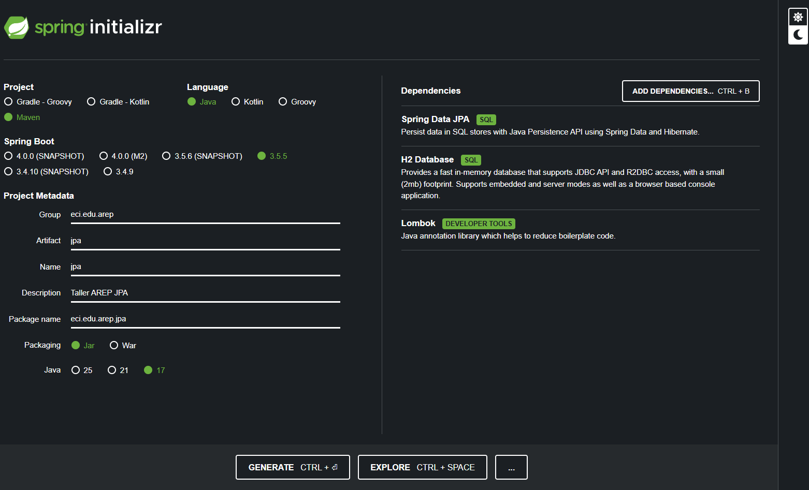
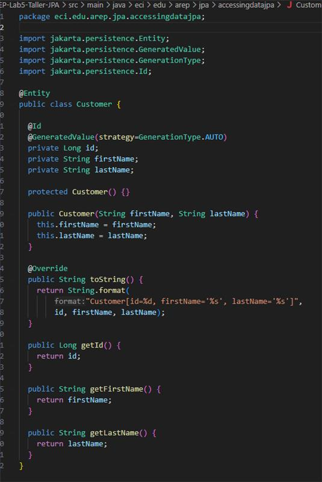
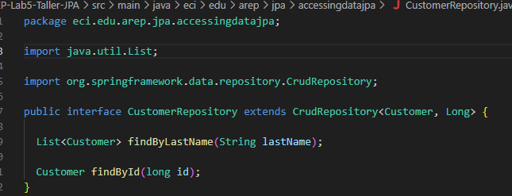
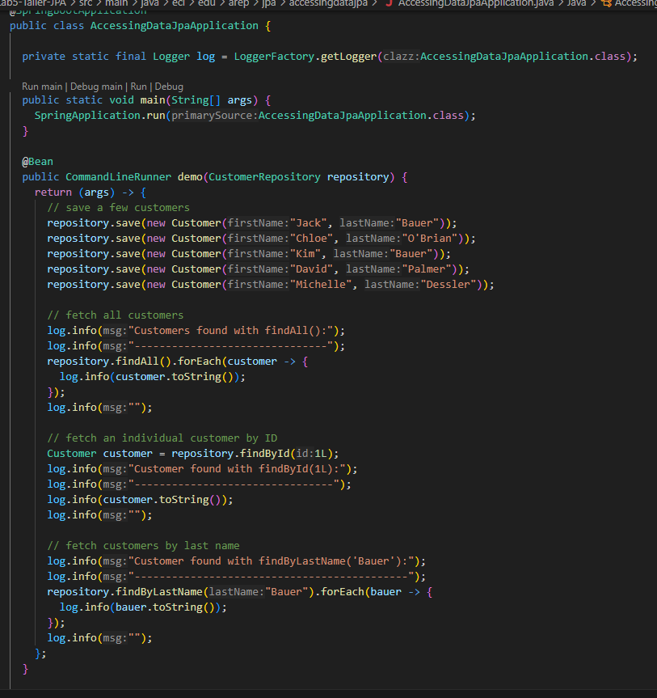
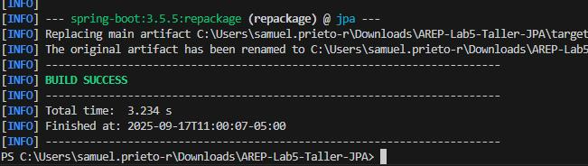
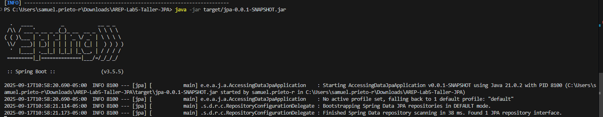
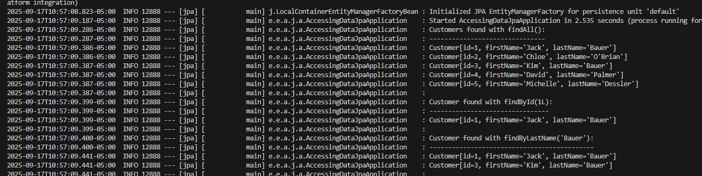

# Taller JPA - AREP Lab 5

**Autor:** Alejandro Prieto  
**Guía base:** [Spring - Accessing Data with JPA](https://spring.io/guides/gs/accessing-data-jpa/)

---

## Objetivo

El objetivo de este taller es implementar una aplicación básica en Spring Boot utilizando **Spring Data JPA** e **H2 Database** para almacenar y consultar datos desde una base de datos relacional en memoria.

---

## Tecnologías utilizadas

- Java 17  
- Spring Boot 3.5.5  
- Spring Data JPA  
- H2 Database  
- Maven

---

## Pasos realizados

### 1. Inicialización del Proyecto

Se generó un proyecto con Spring Initializr utilizando el siguiente enlace:  
[Proyecto Preconfigurado](https://start.spring.io/#!type=maven-project&language=java&platformVersion=3.5.5&packaging=jar&jvmVersion=17&groupId=com.example&artifactId=accessing-data-jpa&name=accessing-data-jpa&description=Demo%20project%20for%20Spring%20Boot&packageName=com.example.accessing-data-jpa&dependencies=data-jpa,h2)

  
**Inicializador de Spring Boot**

---

### 2. Definición de la Entidad `Customer`

Se creó la clase `Customer` en:  
`src/main/java/com/example/accessingdatajpa/Customer.java`

```java
@Entity
public class Customer {
    @Id
    @GeneratedValue(strategy = GenerationType.AUTO)
    private Long id;
    private String firstName;
    private String lastName;

    protected Customer() {}

    public Customer(String firstName, String lastName) {
        this.firstName = firstName;
        this.lastName = lastName;
    }

    // Getters y toString()
}
````


**Entidad JPA `Customer`**

---

### 3. Creación del Repositorio `CustomerRepository`

Se implementó la interfaz `CustomerRepository` en:
`src/main/java/com/example/accessingdatajpa/CustomerRepository.java`

```java
public interface CustomerRepository extends CrudRepository<Customer, Long> {
    List<Customer> findByLastName(String lastName);
    Customer findById(long id);
}
```


**Repositorio con métodos personalizados**

---

### 4. Clase principal `AccessingDataJpaApplication`

Se configuró la clase principal de la aplicación para ejecutar queries de prueba al iniciar.
`src/main/java/com/example/accessingdatajpa/AccessingDataJpaApplication.java`

```java
@SpringBootApplication
public class AccessingDataJpaApplication {
    private static final Logger log = LoggerFactory.getLogger(AccessingDataJpaApplication.class);

    public static void main(String[] args) {
        SpringApplication.run(AccessingDataJpaApplication.class, args);
    }

    @Bean
    public CommandLineRunner demo(CustomerRepository repository) {
        return (args) -> {
            repository.save(new Customer("Jack", "Bauer"));
            repository.save(new Customer("Chloe", "O'Brian"));
            repository.save(new Customer("Kim", "Bauer"));
            repository.save(new Customer("David", "Palmer"));
            repository.save(new Customer("Michelle", "Dessler"));

            log.info("Customers found with findAll():");
            repository.findAll().forEach(customer -> log.info(customer.toString()));

            log.info("Customer found with findById(1L):");
            log.info(repository.findById(1L).toString());

            log.info("Customer found with findByLastName('Bauer'):");
            repository.findByLastName("Bauer").forEach(b -> log.info(b.toString()));
        };
    }
}
```


**Clase principal con pruebas automáticas**

---

## Compilación y ejecución

### 1. Construcción del JAR

```bash
./mvnw clean package
```


**Ejecución del build con Maven**



---

### 2. Ejecución de la aplicación

```bash
java -jar target/accessing-data-jpa-0.0.1-SNAPSHOT.jar
```


**Aplicación corriendo**

### 🔍 Salida esperada

```text
Customers found with findAll():
Customer[id=1, firstName='Jack', lastName='Bauer']
Customer[id=2, firstName='Chloe', lastName='O'Brian']
Customer[id=3, firstName='Kim', lastName='Bauer']
Customer[id=4, firstName='David', lastName='Palmer']
Customer[id=5, firstName='Michelle', lastName='Dessler']

Customer found with findById(1L):
Customer[id=1, firstName='Jack', lastName='Bauer']

Customer found with findByLastName('Bauer'):
Customer[id=1, firstName='Jack', lastName='Bauer']
Customer[id=3, firstName='Kim', lastName='Bauer']
```


**Salida en consola**

---

## Conclusiones

* Se implementó una aplicación funcional utilizando **Spring Boot** y **Spring Data JPA**.
* No fue necesario escribir implementaciones personalizadas del repositorio gracias al poder de Spring Data.
* Se utilizó una base de datos en memoria **H2**, ideal para pruebas y desarrollo rápido.
* El comportamiento fue exactamente el esperado, lo cual valida el correcto desarrollo del taller.

---

## Recursos

* Guía oficial: [Accessing Data with JPA - Spring](https://spring.io/guides/gs/accessing-data-jpa/)
